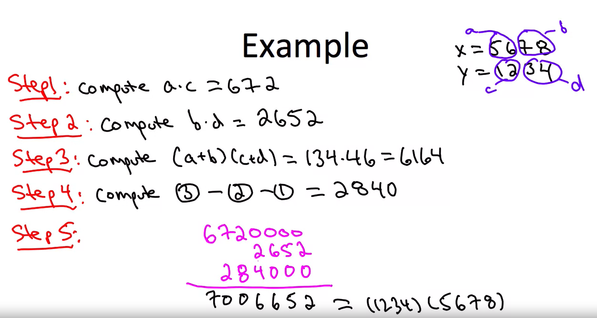
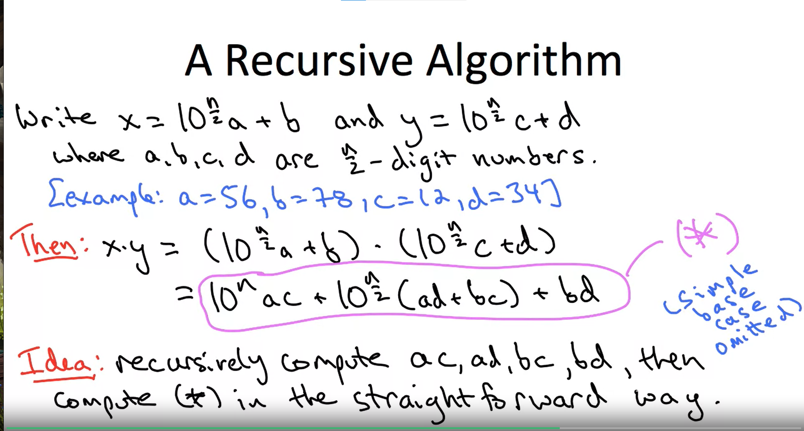

## brief intro
The following image is from coursera's course which is called Divided And Conquer opened from Stanford University.  
<!--傻眼 最後要用兩個空白才能換行 -->
n = digit  
a, b = (digit_1)[0..n/2], (digit_1)[n/2..]  
c, d = (digit_2)[0..n/2], (digit_2)[n/2..]  

把上述的數字分成a,b,c,d後進行下列公式運算  
### 我的猜測(但有誤)
麻煩是在如何計算結果
ex. 123\*26
a = 12, b =3  
c = 2, d = 6  
1. a\*c 後面幾顆 0 = b\*c的位數 所以b\*c = (int)log(18)+1 = 2  
    so a\*c = 2400 
2. 3)-2)-1) 的這步運算要到幾位數 = (int)log(a\*c) = round(log(2400)) = 3(need 3 digit)  
3)-2)-1) =  b\*c+a\*d = 780(until 3 digit)
3. b\*d = 18
4. Add all result -> 2400 + 18 + 780 = 3198

ex. 24*39
a = 2, b = 4  
c = 3, d = 9  
按照上面的計算過程  
1. b\*d = 36  
2. a\*c = 600
3. bc+ad = 12 + 18 = 300
4. Add all 936  

ex. 99*18 
a = 9, b = 9  
c = 1, d = 8  
1. b\*d = 72
2. a\*c = 900
3. bc+ad = 9+72 = 810 because round(log(900)) = 3
4. 1782
ex. 396*2499
a = 39, b = 6  
c = 24, d = 99  
1. b\*d = 594  
2. a\*c = 936000  
3. bc+ad = 144+3861 = 400500  
4. add all 1,337,094 **(出錯)** 正確答案為 989,604
### 老師解釋

利用公式進行遞迴運算，上述的計算只是粗略推估，但真正要利用遞迴才能做正確的運算  
**值得注意的是中間有ad+bc，但我們不希望有四次乘法運算(如同小學乘法)**，所以才會有(a+b)(c+d) - b\*d - a\*c = ad+bc 只計算(a+b)(c+d)的結果然後去減掉前兩個未加位數前的數字  
ex. 1234\*5678  
a\*c = 672  
b\*d = 2652  
(a+b)(c+d) = 6164  
6164-2652-672 = 2840 **(不用乘法)**

